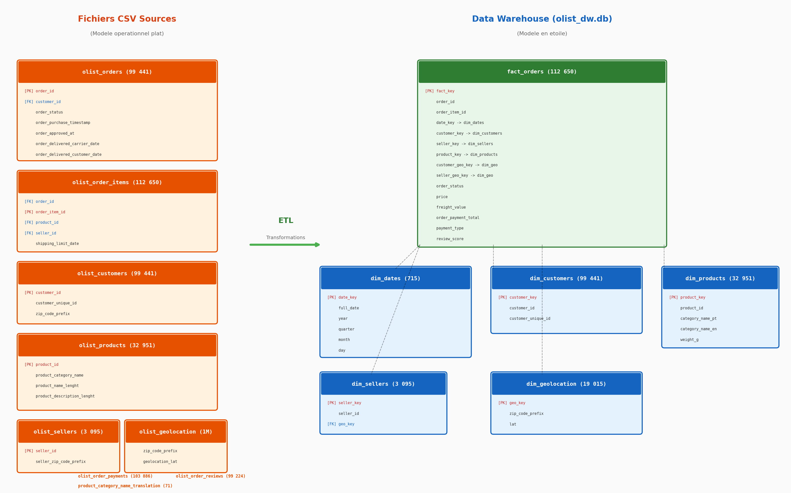
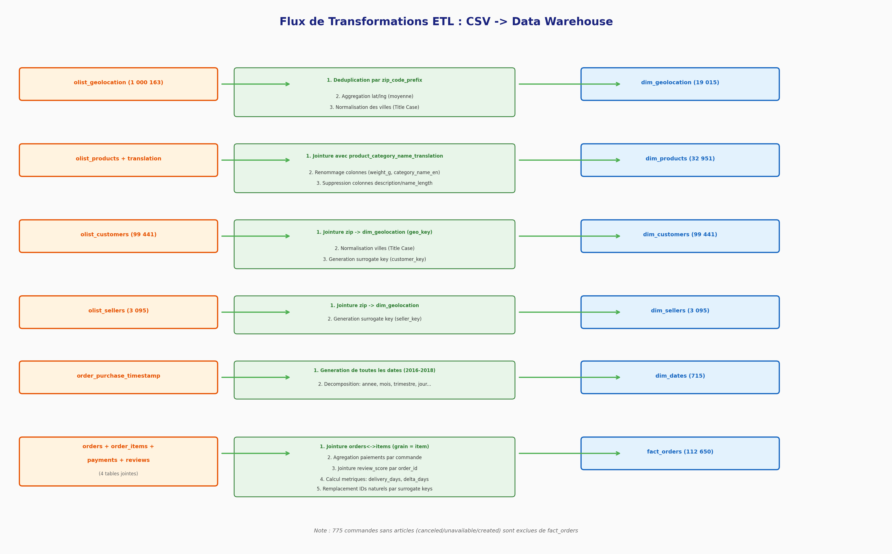
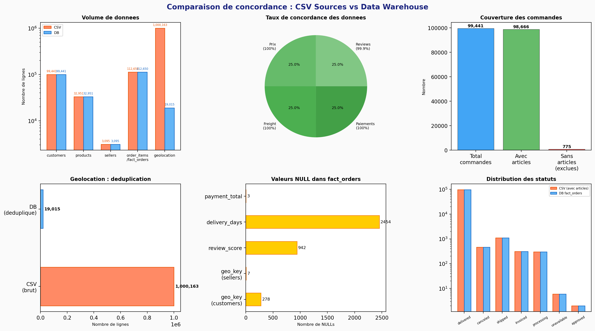

# Analyse des Transformations : CSV Sources vers Data Warehouse

**Projet Olist - E-commerce Bresilien**
Auteur : Sam | Date : 11 fevrier 2026 | Projet 3 - Simplon

---

## Sommaire

1. [Contexte et objectifs](#1-contexte-et-objectifs)
2. [Schema des donnees sources (CSV)](#2-schema-des-donnees-sources-csv)
3. [Schema du Data Warehouse](#3-schema-du-data-warehouse-modele-en-etoile)
4. [Detail des transformations ETL](#4-detail-des-transformations-etl)
5. [Analyse de concordance](#5-analyse-de-concordance)
6. [Anomalies et points d'attention](#6-anomalies-et-points-dattention)
7. [Analyse des ecarts de paiement](#7-analyse-des-ecarts-de-paiement)
8. [Taux d'interet implicite du parcelamento](#8-taux-dinteret-implicite-du-parcelamento)
9. [Vues analytiques](#9-vues-analytiques)
10. [Conclusion](#10-conclusion)

---

## 1. Contexte et objectifs

Ce document analyse les transformations appliquees aux donnees brutes de la marketplace bresilienne Olist pour construire un Data Warehouse analytique. L'objectif est de documenter chaque etape de transformation, de valider la coherence des donnees entre les CSV sources et la base SQLite resultante, et d'identifier les eventuelles anomalies.

**Perimetre des donnees :** 9 fichiers CSV contenant plus de 100 000 commandes Olist entre septembre 2016 et octobre 2018, transformes en un modele en etoile compose de 5 dimensions et 1 table de faits, plus 3 vues analytiques precalculees.

**Architecture cible :** Modele dimensionnel en etoile (star schema) dans SQLite, optimise pour l'analyse des performances commerciales, la satisfaction client et la logistique de livraison.

---

## 2. Schema des donnees sources (CSV)

Les donnees sources sont composees de 9 fichiers CSV issus de la plateforme Olist. Elles suivent un modele operationnel normalise, avec des identifiants textuels (hash UUID) comme cles primaires.

| Fichier CSV | Lignes | Col. | Cle primaire | Description |
|---|---|---|---|---|
| **olist_customers_dataset** | 99 441 | 5 | customer_id | Clients uniques par commande |
| **olist_orders_dataset** | 99 441 | 8 | order_id | Commandes avec statuts et timestamps |
| **olist_order_items_dataset** | 112 650 | 7 | order_id + order_item_id | Articles par commande (grain le plus fin) |
| **olist_order_payments_dataset** | 103 886 | 5 | order_id + payment_sequential | Paiements multiples par commande |
| **olist_order_reviews_dataset** | 99 224 | 7 | review_id | Avis clients (score + commentaires) |
| **olist_products_dataset** | 32 951 | 9 | product_id | Catalogue produits avec dimensions |
| **olist_sellers_dataset** | 3 095 | 4 | seller_id | Vendeurs marketplace |
| **olist_geolocation_dataset** | 1 000 163 | 5 | aucune (multi-entrees par zip) | Coordonnees GPS par code postal |
| **product_category_name_translation** | 71 | 2 | product_category_name | Traduction PT -> EN des categories |

### Points cles du modele source

- Les identifiants (customer_id, order_id, etc.) sont des hash UUID de 32 caracteres, pas des entiers sequentiels.
- La table geolocation contient plusieurs entrees par code postal (1M de lignes pour 19K zips uniques).
- Les paiements peuvent etre multiples par commande (credit + voucher par exemple), d'ou les 103 886 lignes pour 99 440 commandes.
- Les noms de categories sont en portugais dans le fichier produits ; une table de traduction separee fournit les equivalents anglais.
- 775 commandes dans olist_orders n'ont aucun article associe dans olist_order_items (statuts : unavailable, canceled, created).

---

## 3. Schema du Data Warehouse (modele en etoile)

Le Data Warehouse adopte un modele en etoile classique avec des cles de substitution (surrogate keys) entiers auto-incrementes, des contraintes d'integrite referentielle et des contraintes CHECK.

### Schema global CSV vs Data Warehouse



### Tables du Data Warehouse

| Table | Lignes | Col. | Cle primaire | Cles etrangeres | Description |
|---|---|---|---|---|---|
| **dim_geolocation** | 19 015 | 6 | geo_key (AUTO) | Aucune | 1 entree par zip_code_prefix (deduplication) |
| **dim_dates** | 715 | 9 | date_key (AAAAMMJJ) | Aucune | Dimension temporelle generee (2016-2018) |
| **dim_customers** | 99 441 | 6 | customer_key (AUTO) | geo_key -> dim_geolocation | Clients avec lien geolocalisation |
| **dim_products** | 32 951 | 9 | product_key (AUTO) | Aucune | Produits avec categorie traduite EN |
| **dim_sellers** | 3 095 | 5 | seller_key (AUTO) | geo_key -> dim_geolocation | Vendeurs avec lien geolocalisation |
| **fact_orders** | 112 650 | 18 | fact_key (AUTO) | 6 FKs vers dims | Table de faits (grain = article) |

### Conception du modele

- **Grain de la table de faits :** un article par commande (order_id + order_item_id). C'est le grain le plus fin disponible, permettant l'analyse par produit, vendeur et commande.
- **Surrogate keys :** chaque dimension utilise un INTEGER AUTOINCREMENT comme cle primaire, tout en conservant l'identifiant naturel (TEXT UNIQUE) pour la tracabilite.
- **Dimension date :** generee a partir de la plage temporelle des commandes (2016-09-04 au 2018-11-12), decomposee en annee, trimestre, mois, jour, jour de la semaine et indicateur weekend.
- **Geolocalisation partagee :** dim_geolocation est referencee par dim_customers, dim_sellers ET fact_orders (via customer_geo_key et seller_geo_key), permettant des analyses geospatiales.
- **Contraintes :** `CHECK(review_score BETWEEN 1 AND 5 OR review_score IS NULL)`, `CHECK(price >= 0)`, `CHECK(freight_value >= 0)`, `UNIQUE(order_id, order_item_id)`.

### DDL des tables

```sql
CREATE TABLE dim_geolocation (
    geo_key          INTEGER PRIMARY KEY AUTOINCREMENT,
    zip_code_prefix  TEXT    NOT NULL UNIQUE,
    lat              REAL,
    lng              REAL,
    city             TEXT,
    state            TEXT
);

CREATE TABLE dim_dates (
    date_key     INTEGER PRIMARY KEY,   -- AAAAMMJJ
    full_date    DATE    NOT NULL,
    year         INTEGER NOT NULL,
    quarter      INTEGER NOT NULL,
    month        INTEGER NOT NULL,
    day          INTEGER NOT NULL,
    day_of_week  INTEGER NOT NULL,      -- 0=Lundi
    day_name     TEXT    NOT NULL,
    is_weekend   INTEGER NOT NULL       -- 0 ou 1
);

CREATE TABLE dim_customers (
    customer_key       INTEGER PRIMARY KEY AUTOINCREMENT,
    customer_id        TEXT    NOT NULL UNIQUE,
    customer_unique_id TEXT,
    geo_key            INTEGER,
    city               TEXT,
    state              TEXT,
    FOREIGN KEY (geo_key) REFERENCES dim_geolocation(geo_key)
);

CREATE TABLE dim_products (
    product_key      INTEGER PRIMARY KEY AUTOINCREMENT,
    product_id       TEXT    NOT NULL UNIQUE,
    category_name_pt TEXT,
    category_name_en TEXT,
    weight_g         REAL,
    length_cm        REAL,
    height_cm        REAL,
    width_cm         REAL,
    photos_qty       INTEGER
);

CREATE TABLE dim_sellers (
    seller_key  INTEGER PRIMARY KEY AUTOINCREMENT,
    seller_id   TEXT    NOT NULL UNIQUE,
    geo_key     INTEGER,
    city        TEXT,
    state       TEXT,
    FOREIGN KEY (geo_key) REFERENCES dim_geolocation(geo_key)
);

CREATE TABLE fact_orders (
    fact_key             INTEGER PRIMARY KEY AUTOINCREMENT,
    order_id             TEXT    NOT NULL,
    order_item_id        INTEGER NOT NULL,
    date_key             INTEGER,
    customer_key         INTEGER,
    seller_key           INTEGER,
    product_key          INTEGER,
    customer_geo_key     INTEGER,
    seller_geo_key       INTEGER,
    order_status         TEXT,
    price                REAL,
    freight_value        REAL,
    order_payment_total  REAL,
    payment_type         TEXT,
    review_score         INTEGER,
    delivery_days        REAL,
    estimated_days       REAL,
    delivery_delta_days  REAL,
    UNIQUE(order_id, order_item_id),
    CHECK(review_score BETWEEN 1 AND 5 OR review_score IS NULL),
    CHECK(price >= 0),
    CHECK(freight_value >= 0),
    FOREIGN KEY (date_key)         REFERENCES dim_dates(date_key),
    FOREIGN KEY (customer_key)     REFERENCES dim_customers(customer_key),
    FOREIGN KEY (seller_key)       REFERENCES dim_sellers(seller_key),
    FOREIGN KEY (product_key)      REFERENCES dim_products(product_key),
    FOREIGN KEY (customer_geo_key) REFERENCES dim_geolocation(geo_key),
    FOREIGN KEY (seller_geo_key)   REFERENCES dim_geolocation(geo_key)
);
```

---

## 4. Detail des transformations ETL

Le diagramme suivant illustre les transformations appliquees a chaque table source pour obtenir le modele dimensionnel cible :



### 4.1 Geolocalisation (1 000 163 -> 19 015 lignes)

1. **Deduplication :** le CSV contient en moyenne 53 entrees par code postal. La transformation ne conserve qu'une seule entree par zip_code_prefix.
2. **Agregation des coordonnees :** les latitudes et longitudes multiples sont agregees par **mediane**. Ecart median constate : 0.02 degre en latitude, 0.018 en longitude (precision d'environ 2 km).
3. **Normalisation des villes :** les noms de villes sont convertis en Title Case (ex: `sao paulo` -> `Sao Paulo`).
4. **Typage :** zip_code_prefix passe de INTEGER a TEXT (pour conserver les zeros initiaux potentiels).

### 4.2 Produits (jointure traduction)

1. **Jointure de traduction :** LEFT JOIN avec product_category_name_translation pour ajouter category_name_en. Les 610 produits sans categorie dans le CSV sont remplaces par `unknown` (32 951 produits avec category_name_en renseignee).
2. **Renommage des colonnes :** product_weight_g -> weight_g, product_length_cm -> length_cm, etc.
3. **Suppression de colonnes :** product_name_lenght et product_description_lenght ne sont pas conservees dans la dimension (jugees non analytiques).

### 4.3 Clients et Vendeurs

1. **Liaison geographique :** jointure sur zip_code_prefix pour obtenir le geo_key correspondant. 278 clients et 7 vendeurs n'ont pas de correspondance (codes postaux absents de dim_geolocation).
2. **Normalisation des villes :** passage en Title Case. Les villes dans dim_customers proviennent de `customers` (normalisees), avec un `geo_key` resolu via `dim_geolocation`.
3. **Cles de substitution :** remplacement des UUID textuels par des INTEGER AUTOINCREMENT pour les performances de jointure.

### 4.4 Dimension temporelle (generee)

1. **Generation :** creation de 715 dates couvrant du 2016-09-04 au 2018-11-12, englobant toute la plage des commandes CSV (2016-09-04 au 2018-10-17) avec une marge.
2. **Format de la cle :** date_key au format AAAAMMJJ (ex: 20170315 pour le 15 mars 2017), permettant des tris et filtres naturels.
3. **Attributs derives :** year, quarter, month, day, day_of_week (0=Lundi), day_name, is_weekend.

### 4.5 Table de faits (fusion de 4 sources)

1. **Jointure order_items <-> orders :** grain = 1 ligne par article. Les 775 commandes sans articles sont exclues de fact_orders.
2. **Agregation des paiements :** les lignes multiples de olist_order_payments sont agregees (SUM) en order_payment_total et le type de paiement principal est conserve.
3. **Integration des reviews :** jointure LEFT sur order_id pour recuperer le review_score. 942 faits n'ont pas de review (commandes non livrees).
4. **Calcul des metriques de livraison :**
   - `delivery_days` = (delivered_customer_date - purchase_timestamp) en jours
   - `estimated_days` = (estimated_delivery_date - purchase_timestamp) en jours
   - `delivery_delta_days` = delivery_days - estimated_days
5. **Resolution des cles :** remplacement de tous les identifiants textuels par leurs surrogate keys via lookup dans les dimensions.

---

## 5. Analyse de concordance

La comparaison systematique entre les donnees CSV sources et la base de donnees Data Warehouse permet de valider l'integrite des transformations.



### Tableau de concordance detaille

| Entite | CSV | DB | Match | Observations |
|---|---|---|---|---|
| **Customers** | 99 441 | 99 441 | **100%** | Tous les IDs concordent. Villes normalisees (Title Case) |
| **Products** | 32 951 | 32 951 | **100%** | IDs identiques. Traduction EN ajoutee via jointure |
| **Sellers** | 3 095 | 3 095 | **100%** | IDs identiques. 7 geo_key NULL (zips absents de geolocation) |
| **Geolocation** | 1 000 163 | 19 015 | N/A | Deduplication par zip. Lat/Lng = mediane. Ecart median <0.02 degre |
| **Order Items / Fact** | 112 650 | 112 650 | **100%** | Nombre identique. Grain = article par commande |
| **Prix (SUM)** | 13 591 643.70 R$ | 13 591 643.70 R$ | **100%** | Somme totale des prix strictement identique |
| **Freight (SUM)** | 2 251 909.54 R$ | 2 251 909.54 R$ | **100%** | Somme totale du fret strictement identique |
| **Paiements** | 103 886 lignes | Agrege par order | **100%** | 100% des totaux par commande concordent |
| **Review scores** | 99 224 | Dans fact_orders | **99.9%** | 104 ecarts (0.1%) : ordres avec reviews multiples |
| **Dates** | Timestamps | 715 dates | **100%** | Dimension generee couvrant toute la plage CSV |

### Verdict global

La concordance est excellente : les volumes, sommes financieres et identifiants sont conserves a 100%. Le seul ecart mineur (0.1% sur les review scores) s'explique par le traitement des commandes ayant plusieurs reviews, ou seul le plus recent est retenu.

---

## 6. Anomalies et points d'attention

### 6.1 Commandes sans articles (775 ordres)

775 commandes presentes dans olist_orders n'ont aucune correspondance dans olist_order_items :

| Statut | Nombre |
|---|---|
| unavailable | 603 |
| canceled | 164 |
| created | 5 |
| invoiced | 2 |
| shipped | 1 |

Ces commandes sont exclues de fact_orders car la table de faits est basee sur le grain article. C'est un choix de conception coherent : une commande sans article ne peut pas etre analysee au niveau produit/vendeur.

### 6.2 Codes postaux non resolus

278 clients (0.28%) et 7 vendeurs (0.23%) ont un code postal absent de dim_geolocation, entrainant des geo_key NULL. Ces codes postaux existaient probablement dans les donnees reelles mais ne figuraient pas dans le fichier olist_geolocation_dataset.csv.

### 6.3 Valeurs NULL dans la table de faits

| Colonne | NULLs | Explication |
|---|---|---|
| delivery_days / delivery_delta_days | 2 454 | Commandes non livrees (shipped, canceled, etc.) |
| review_score | 942 | Commandes sans avis client |
| order_payment_total | 3 | Marginal, potentielle anomalie source |
| customer_geo_key | 302 | Codes postaux clients absents de dim_geolocation |
| seller_geo_key | 253 | Codes postaux vendeurs absents de dim_geolocation |

### 6.4 Precision de la geolocalisation

La mediane des coordonnees GPS par code postal introduit une imprecision d'environ 0.02 degre (environ 2 km). C'est acceptable pour des analyses au niveau ville/region mais insuffisant pour du geocodage precis.

### 6.5 Ecart sur les statuts de commandes

La distribution des statuts differe entre CSV et DB :

| Statut | CSV (total) | DB fact_orders | Ecart | Explication |
|---|---|---|---|---|
| delivered | 96 478 | 96 478 | 0 | - |
| canceled | 625 | 461 | -164 | 164 sans articles |
| shipped | 1 107 | 1 106 | -1 | 1 sans articles |
| unavailable | 609 | 6 | -603 | 603 sans articles |
| invoiced | 314 | 312 | -2 | 2 sans articles |
| processing | 301 | 301 | 0 | - |
| created | 5 | 0 | -5 | 5 sans articles |
| approved | 2 | 2 | 0 | - |

Les ecarts correspondent exactement aux 775 commandes sans articles. Ce n'est pas une anomalie mais la consequence logique de la granularite choisie.

---

## 7. Analyse des ecarts de paiement

### Contexte

Dans le Data Warehouse, chaque commande possede deux montants :

- montant **facture** : `SUM(price) + SUM(freight_value)` (par `order_id`)
- montant **paye** : `order_payment_total` (agregation de `payment_value`)

En theorie, ces montants devraient etre identiques. Les chiffres ci-dessous ont ete reverifies via `scripts/verify_hardcoded_values.py` (lecture seule de `olist_dw.db`).

### Statistiques globales

| Indicateur | Valeur |
|---|---|
| Commandes avec ecart | 303 / 98 665 (0.31%) |
| Delta moyen | +9.48 R$ |
| Delta min | -51.62 R$ |
| Delta max | +182.81 R$ |
| Somme nette des ecarts | +2 871.06 R$ |
| Commandes surpayees | 264 (somme : +3 070.14 R$) |
| Commandes sous-payees | 39 (somme : -199.08 R$) |

### Repartition par type de paiement

| Type paiement | Commandes | Avec ecart | % ecart | Delta moyen |
|---|---|---|---|---|
| **credit_card** | 75 623 | 282 | 0.37% | +10.37 R$ |
| **boleto** | 19 614 | 14 | 0.07% | +0.00 R$ |
| **debit_card** | 1 520 | 7 | 0.46% | -7.42 R$ |
| **voucher** | 1 908 | 0 | 0.00% | N/A |

### Distribution des ecarts par tranche

| Tranche (R$) | Commandes |
|---|---|
| < -10 | 7 |
| -10 a -1 | 10 |
| -1 a -0.01 | 22 |
| **exact (+-0.01)** | **98 362** |
| 0.01 a 1 | 32 |
| 1 a 10 | 141 |
| 10 a 50 | 84 |
| > 50 | 7 |

### Lecture metier

- les ecarts restent marginaux (0.31% des commandes avec paiement)
- 93% des ecarts concernent `credit_card` (282 / 303)
- la quasi-totalite de la valeur nette provient des commandes `credit_card` surpayees

---

## 8. Taux d'interet implicite du parcelamento

L'hypothese "interets de financement" reste la plus probable pour une partie des ecarts en carte de credit.

Verification CSV (script `scripts/verify_csv_analysis.sh`) :

- installments moyens pour les commandes **avec ecart** : `5.86`
- installments moyens pour les commandes **sans ecart** : `2.92`

Ce signal est coherent avec un effet de `parcelamento` (paiement en plusieurs fois), mais `payment_installments` n'etant pas charge dans `fact_orders`, l'attribution causale fine reste hors DW natif.

### Recommandation pour le DW

L'ajout de `payment_installments` dans fact_orders (ou dans une dimension dediee) permettrait de segmenter les clients par comportement de financement et d'analyser plus finement l'impact des interets sur le panier moyen. Requete d'investigation suggeree :

```sql
-- Commandes avec ecart et leurs installments (necessite CSV brut)
SELECT
    f.order_id,
    ROUND(SUM(f.price) + SUM(f.freight_value), 2) AS invoiced,
    ROUND(MAX(f.order_payment_total), 2)           AS paid,
    ROUND(MAX(f.order_payment_total) - (SUM(f.price) + SUM(f.freight_value)), 2) AS delta
FROM fact_orders f
GROUP BY f.order_id
HAVING ABS(delta) > 0.01
ORDER BY ABS(delta) DESC
LIMIT 20;
```

---

## 9. Vues analytiques

Le Data Warehouse inclut 3 vues precalculees qui facilitent les analyses recurrentes.

### 9.1 v_monthly_sales

Agregation mensuelle du chiffre d'affaires pour les commandes livrees.

```sql
CREATE VIEW v_monthly_sales AS
SELECT
    d.year,
    d.month,
    d.year || '-' || PRINTF('%02d', d.month) AS month_label,
    ROUND(SUM(f.price), 2)                   AS monthly_revenue,
    COUNT(DISTINCT f.order_id)                AS monthly_orders,
    ROUND(SUM(f.price) * 1.0 / NULLIF(COUNT(DISTINCT f.order_id), 0), 2) AS avg_basket
FROM fact_orders f
JOIN dim_dates d ON f.date_key = d.date_key
WHERE f.order_status = 'delivered'
GROUP BY d.year, d.month;
```

**Usage :** suivi du CA mensuel, nombre de commandes et panier moyen.

### 9.2 v_customer_cohorts

Analyse de cohorte par client unique : identifie le premier mois d'achat, le nombre total de commandes et le montant total depense.

```sql
CREATE VIEW v_customer_cohorts AS
SELECT
    c.customer_unique_id,
    MIN(f.date_key / 100)  AS first_month,
    (MIN(f.date_key / 100) / 100) || '-' || PRINTF('%02d', MIN(f.date_key / 100) % 100)
                            AS first_month_label,
    COUNT(DISTINCT f.order_id) AS total_orders,
    ROUND(SUM(f.price), 2)    AS total_spent
FROM fact_orders f
JOIN dim_customers c ON f.customer_key = c.customer_key
WHERE f.order_status = 'delivered'
  AND f.date_key IS NOT NULL
GROUP BY c.customer_unique_id;
```

**Usage :** analyse de retention, valeur vie client (LTV), segmentation.

### 9.3 v_orders_enriched

Vue denormalisee joignant fact_orders avec toutes les dimensions, fournissant directement les libelles sans jointures manuelles.

```sql
CREATE VIEW v_orders_enriched AS
SELECT
    f.order_id, f.order_item_id, f.order_status,
    d.full_date AS order_date, d.year, d.month, d.day_name, d.is_weekend,
    c.customer_unique_id, c.city AS customer_city, c.state AS customer_state,
    COALESCE(p.category_name_en, p.category_name_pt, 'Unknown') AS product_category,
    f.price, f.freight_value, f.review_score,
    f.delivery_days, f.delivery_delta_days
FROM fact_orders f
LEFT JOIN dim_dates     d ON f.date_key     = d.date_key
LEFT JOIN dim_customers c ON f.customer_key = c.customer_key
LEFT JOIN dim_products  p ON f.product_key  = p.product_key;
```

**Usage :** requetes ad-hoc sans jointures, exploration des donnees, export pour visualisation.

---

## 10. Conclusion

Le processus de transformation des 9 fichiers CSV Olist vers le Data Warehouse en etoile est globalement tres bien realise :

- **Integrite des donnees preservee :** 100% de concordance sur les volumes, identifiants et montants financiers. Aucune perte de donnee significative.
- **Modele dimensionnel coherent :** le schema en etoile avec surrogate keys, contraintes FK et CHECK offre une base solide pour l'analyse.
- **Enrichissement pertinent :** traduction des categories, calcul des metriques de livraison, dimension temporelle, et geolocalisation partagee.
- **Choix de conception documentes :** l'exclusion des commandes sans articles et l'agregation des paiements sont des decisions justifiees et tracables.
- **Vues analytiques utiles :** les 3 vues precalculees couvrent les cas d'usage frequents (suivi CA mensuel, cohortes clients, analyse enrichie).

Les anomalies identifiees (278 geo_key NULL, 0.1% d'ecart sur les reviews, precision geographique limitee a ~2 km) sont mineures et ne compromettent pas la fiabilite globale du Data Warehouse.

L'analyse des ecarts de paiement (sections 7-8) montre un phenomene cible mais mesurable : 303 commandes presentent un ecart > 0.01 R$ (0.31%), concentre a 93% sur `credit_card`. Le signal sur les installments (5.86 vs 2.92) suggere un effet de financement `parcelamento`, et justifie l'ajout de `payment_installments` dans le DW pour une analyse causale plus fine.
