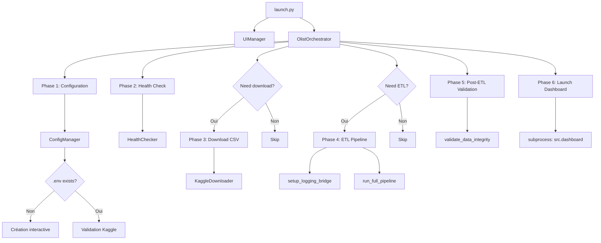

# Launcher Automatisé - Documentation Technique

## Vue d'ensemble

Le launcher automatisé (`launch.py`) orchestre l'ensemble du setup et du lancement du dashboard Olist avec une interface CLI engageante style Matrix.

## Architecture

### Structure des Fichiers

```
launch.py                          # Point d'entrée CLI
src/launcher/
├── __init__.py                    # Exports publics
├── orchestrator.py                # Orchestration des phases
├── ui.py                          # Interface visuelle Matrix
├── config_manager.py              # Gestion .env et Kaggle
├── healthcheck.py                 # Diagnostics système
├── downloader.py                  # Téléchargement CSV
└── logger_adapter.py              # Bridge logging → UI
```

### Dépendances

- `click` : Interface CLI et parsing d'arguments
- `tqdm` : Barres de progression (future utilisation)
- `colorama` : Couleurs cross-platform
- `python-dotenv` : Gestion fichiers .env
- Modules existants : `src.etl.pipeline`, `src.config`, `src.dashboard`

## Flux d'Exécution



## Modules

### 1. `ui.py` - Interface Utilisateur

**Responsabilités** :
- Animation Matrix (20 lignes de caractères aléatoires)
- Banner ASCII "OLIST Dashboard Launcher v1.0"
- Messages colorés avec symboles (✓, ✗, ⚠, ℹ, ⊘)
- Context manager pour phases avec timing automatique
- Box de succès finale

**Palette de couleurs** :
```python
COLORS = {
    "banner": Fore.GREEN + Style.BRIGHT,   # Matrix green
    "phase": Fore.CYAN + Style.BRIGHT,     # Headers
    "success": Fore.GREEN,                  # Succès
    "warning": Fore.YELLOW,                 # Avertissements
    "error": Fore.RED + Style.BRIGHT,      # Erreurs
    "info": Fore.WHITE,                     # Info
    "skip": Fore.MAGENTA,                   # Skip
}
```

**Modes** :
- Normal : Tous les messages
- Verbose : + logs détaillés
- Quiet : Erreurs uniquement

### 2. `orchestrator.py` - Orchestrateur Principal

**Responsabilités** :
- Coordination des 6 phases de lancement
- Logique de skip intelligent (basée sur timestamps et existence)
- Gestion des erreurs avec contextualisation
- Modes : full launch, health check only

**Skip Logic** :
- **Download** : Skip si tous les CSV présents (sauf `--force`)
- **ETL** : Skip si DB existe ET plus récente que les CSV (sauf `--force` ou `--skip-etl`)

**Phases** :
1. Configuration & Validation
2. Pre-flight Health Check
3. Download CSV (conditionnel)
4. ETL Pipeline (conditionnel)
5. Post-ETL Validation
6. Launch Dashboard

### 3. `config_manager.py` - Gestion Configuration

**Responsabilités** :
- Vérification/création du fichier `.env`
- Création interactive avec prompts utilisateur
- Validation credentials Kaggle
- Vérification permissions système

**Workflow création .env** :
```
1. Vérifier existence .env
2. Si absent → Prompt utilisateur
3. Demander KAGGLE_USERNAME
4. Demander KAGGLE_KEY
5. Écrire .env avec template
6. Charger via dotenv
```

### 4. `healthcheck.py` - Diagnostics

**Responsabilités** :
- Vérification structure répertoires
- Vérification dépendances Python
- Vérification présence CSV (9/9)
- Vérification DB (existence, schéma, row counts)
- Validation intégrité données

**Schéma attendu** :
```python
expected_tables = {
    "dim_dates",
    "dim_geolocation",
    "dim_customers",
    "dim_sellers",
    "dim_products",
    "fact_orders",
}
```

**Rapport diagnostic** :
```
Directory Structure: ✓/✗
Python Dependencies: ✓/✗
CSV Files: X/9
Database: ✓ (XX.X MB)
  Schema: ✓ Valid
  Row counts:
    - dim_dates: XXX
    - dim_geolocation: XXX
    - ...
```

### 5. `downloader.py` - Téléchargement CSV

**Responsabilités** :
- Téléchargement dataset Kaggle via CLI
- Décompression automatique
- Vérification fichiers téléchargés
- Génération manifest.txt (line counts, MD5, tailles)

**Dataset** : `olistbr/brazilian-ecommerce`

**Manifest** :
```
# Olist Dataset Manifest
# Generated by launcher

filename.csv                                   XXXXX lines   XX.XX MB  md5hash
...
```

### 6. `logger_adapter.py` - Bridge Logging

**Responsabilités** :
- Capturer les logs du pipeline ETL
- Rediriger vers UIManager pour affichage live
- Handler custom pour logging.Handler
- Restauration logging par défaut après ETL

**Flow** :
```
ETL logger.info(...) → UILogHandler → ui.display_live_log(level, msg)
```

## Options CLI

### Flags Principaux

```bash
--force              # Force re-download + rebuild DB
--skip-etl           # Skip ETL si DB existe
--skip-download      # Skip download si CSV présents
--verbose / -v       # Logs détaillés
--quiet / -q         # Minimal output
--port INTEGER       # Port dashboard (défaut: 8080)
--no-browser         # Pas d'ouverture auto navigateur
--health-check-only  # Diagnostic uniquement
```

### Exemples d'Utilisation

```bash
# Lancement standard (intelligent)
python launch.py

# Rebuild complet
python launch.py --force

# Mode rapide
python launch.py --skip-download --skip-etl

# Diagnostic uniquement
python launch.py --health-check-only

# Port personnalisé
python launch.py --port 8888

# Mode silencieux
python launch.py --quiet

# Mode verbeux
python launch.py --verbose
```

## Makefile Targets

```bash
make launch         # Lancement standard
make launch-force   # Rebuild complet
make launch-quick   # Mode rapide (skip si possible)
make health         # Diagnostic uniquement
```

## Variables d'Environnement

### `.env` (requis)

```bash
KAGGLE_USERNAME=your_username
KAGGLE_KEY=your_api_key
```

### `.env` (optionnel)

```bash
DASHBOARD_PORT=8080              # Port du dashboard
DASHBOARD_SHOW_BROWSER=1         # Auto-open navigateur
```

## Gestion d'Erreurs

### Erreurs Catchées

- `ConfigurationError` : Problème .env ou credentials
- `HealthCheckError` : Échec diagnostic
- `DownloadError` : Échec téléchargement Kaggle
- `LauncherError` : Erreur générale orchestration
- `KeyboardInterrupt` : Interruption utilisateur

### Stratégie

1. Chaque phase utilise un context manager avec try/except
2. Les erreurs sont contextualisées avec le nom de la phase
3. L'UI affiche les erreurs en rouge avec le symbole ✗
4. Le launcher s'arrête à la première erreur critique

## Tests Manuels

### Fresh Install

```bash
rm -rf .env data/
python launch.py
# → Doit créer .env interactivement, télécharger CSV, run ETL, launch
```

### Force Rebuild

```bash
python launch.py --force
# → Doit re-télécharger et rebuild même si déjà fait
```

### Skip Intelligent

```bash
# Avec DB et CSV existants
python launch.py
# → Doit skip download et ETL
```

### Health Check

```bash
python launch.py --health-check-only
# → Doit afficher rapport complet sans lancer
```

### Interruption

```bash
python launch.py
# Ctrl+C pendant ETL
# → Doit afficher "Launcher interrupted by user" et s'arrêter proprement
```

## Améliorations Futures

### Court Terme

- [ ] Progress bar avec `tqdm` pour téléchargement CSV
- [ ] Progress bar pour phases ETL longues
- [ ] Couleurs dans les logs ETL (INFO=blanc, WARNING=jaune, ERROR=rouge)

### Moyen Terme

- [ ] Mode `--watch` : relancer ETL automatiquement si CSV changent
- [ ] Mode `--daemon` : dashboard en arrière-plan
- [ ] Tests unitaires pour chaque module launcher
- [ ] CI/CD avec validation launcher

### Long Terme

- [ ] Support multi-environnements (.env.dev, .env.prod)
- [ ] Plugins pour sources de données alternatives
- [ ] Web UI pour configuration (alternative au CLI)
- [ ] Télémétrie et métriques de performance

## Statistiques

- **Lignes de code** : ~989 lignes
- **Modules** : 8 fichiers Python
- **Dépendances ajoutées** : 1 (colorama)
- **Phases** : 6 phases orchestrées
- **Options CLI** : 8 options

## Avantages

✅ **Zéro modification** du code ETL et dashboard existant
✅ **UX exceptionnelle** avec animation Matrix engageante
✅ **Skip intelligent** basé sur l'état (timestamps, existence)
✅ **Aucune nouvelle dépendance majeure** (colorama seulement)
✅ **Modulaire et testable** (chaque composant isolé)
✅ **Cross-platform** (Python pur, colorama pour les couleurs)
✅ **Robuste** avec gestion d'erreurs complète
✅ **Extensible** pour futures fonctionnalités
